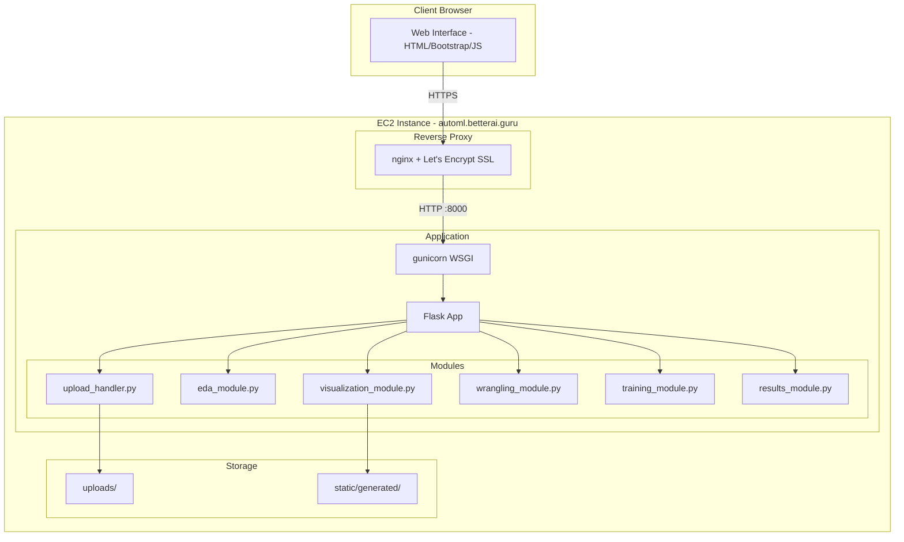
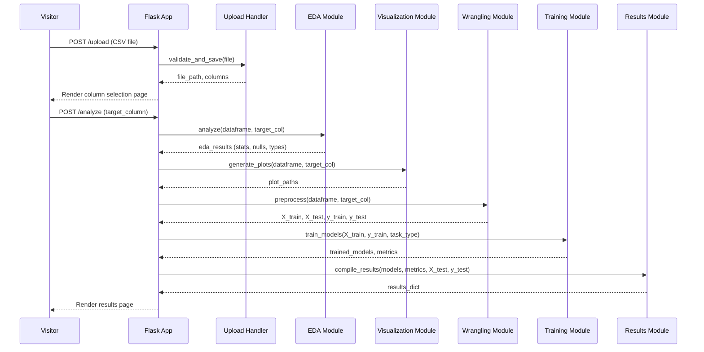

# Design Document: AutoML Web Platform

## Overview

The AutoML Web Platform is a Flask-based web application that automates the complete machine learning pipeline for tabular CSV data. A visitor uploads a dataset, selects a target column, and the platform orchestrates EDA, visualization, preprocessing, model training, and results comparison — all presented through a browser interface at https://automl.betterai.guru.

The current prototype has significant technical debt: duplicated functions across `eda_api.py` and `predictor_api.py`, deprecated scikit-learn APIs, hardcoded file references, no actual file upload handling, and uses the deprecated `gevent` WSGI server. This design describes a clean rewrite with modular architecture, modern APIs, proper file upload handling, and production deployment configuration.

### Key Design Decisions

1. **Modular monolith** — single Flask app with clearly separated modules rather than microservices, appropriate for the workload scale
2. **Synchronous pipeline** — ML pipeline runs synchronously per request with a progress indicator via server-sent events (SSE), avoiding the complexity of background task queues for datasets ≤50MB
3. **File-system storage** — uploaded files and generated images stored on local disk (EC2 EBS), no database needed
4. **No authentication** — the platform is a public demo tool, no user accounts required

## Architecture



### Request Flow



## Components and Interfaces

### Module: `upload_handler.py`

Handles file upload validation, secure storage, and column extraction.

```python
def validate_upload(file: FileStorage) -> tuple[bool, str]:
    """Validate uploaded file is CSV and within size limit.
    Returns (is_valid, error_message).
    """

def save_upload(file: FileStorage, upload_dir: str) -> str:
    """Save file with secure filename, return file path."""

def extract_columns(file_path: str) -> list[str]:
    """Parse CSV and return column names."""

def detect_task_type(series: pd.Series) -> str:
    """Determine 'classification' or 'regression' based on target column values.
    Classification: categorical values or ≤10 unique numeric values.
    Regression: continuous numeric values or >10 unique numeric values.
    """
```

### Module: `eda_module.py`

Computes dataset statistics and quality metrics.

```python
@dataclass
class EDAResults:
    head: pd.DataFrame          # First 5 rows
    shape: tuple[int, int]      # (rows, columns)
    describe: pd.DataFrame      # Descriptive statistics
    null_counts: pd.Series      # Null count per column
    dtypes: pd.Series           # Data type per column
    unique_counts: pd.Series    # Unique values per column

def analyze(dataframe: pd.DataFrame, target_col: str) -> EDAResults:
    """Compute full EDA summary for the dataset."""
```

### Module: `visualization_module.py`

Generates matplotlib/seaborn plots saved as PNG images.

```python
def generate_boxplot(df_numeric: pd.DataFrame, output_path: str) -> str:
    """Generate box plot of numeric features. Returns image path."""

def generate_heatmap(df_numeric: pd.DataFrame, target_col: str, output_path: str, max_features: int = 50) -> str:
    """Generate correlation heatmap. Limits to top N features correlated with target if >50."""

def generate_countplots(df_categorical: pd.DataFrame, output_dir: str) -> list[str]:
    """Generate count plots for each categorical column. Returns list of image paths."""
```

### Module: `wrangling_module.py`

Preprocesses data for model training.

```python
@dataclass
class PreprocessedData:
    X_train: np.ndarray
    X_test: np.ndarray
    y_train: np.ndarray
    y_test: np.ndarray
    feature_names: list[str]
    dropped_columns: list[str]
    duplicates_removed: int

def preprocess(dataframe: pd.DataFrame, target_col: str, test_size: float = 0.2, random_state: int = 42) -> PreprocessedData:
    """Full preprocessing pipeline: drop nulls cols, remove dupes, impute, encode, scale, split."""

def remove_null_columns(df: pd.DataFrame) -> tuple[pd.DataFrame, list[str]]:
    """Remove columns that are entirely null. Returns cleaned df and list of dropped column names."""

def remove_duplicates(df: pd.DataFrame) -> tuple[pd.DataFrame, int]:
    """Remove duplicate rows. Returns cleaned df and count of removed rows."""

def impute_numeric(df: pd.DataFrame) -> pd.DataFrame:
    """Impute missing numeric values using column median."""

def encode_categorical(df: pd.DataFrame) -> pd.DataFrame:
    """Label-encode binary columns, one-hot encode multi-category columns."""

def scale_features(df: pd.DataFrame) -> pd.DataFrame:
    """Standard scale all numeric features (zero mean, unit variance)."""
```

### Module: `training_module.py`

Trains and evaluates multiple models.

```python
@dataclass
class ModelResult:
    name: str
    model: Any
    metrics: dict[str, float]
    predictions: np.ndarray
    failed: bool = False
    error_message: str = ""

def train_classification_models(X_train, y_train, X_test, y_test) -> list[ModelResult]:
    """Train all classification models, return results sorted by accuracy descending."""

def train_regression_models(X_train, y_train, X_test, y_test) -> list[ModelResult]:
    """Train all regression models, return results sorted by R-squared descending."""

def evaluate_classification(model, X_test, y_test) -> dict[str, float]:
    """Compute accuracy, precision, recall, F1 for a trained classifier."""

def evaluate_regression(model, X_test, y_test) -> dict[str, float]:
    """Compute R-squared, MAE, RMSE for a trained regressor."""
```

### Module: `results_module.py`

Compiles training results for display.

```python
@dataclass
class ComparisonResults:
    comparison_table: pd.DataFrame      # Models sorted by primary metric
    best_model_name: str
    best_model_metrics: dict[str, float]
    sample_predictions: pd.DataFrame    # Sample predictions from best model
    chart_path: str                     # Path to bar chart image

def compile_results(model_results: list[ModelResult], task_type: str, X_test, y_test, output_dir: str) -> ComparisonResults:
    """Build comparison table, identify best model, generate chart, get sample predictions."""

def generate_comparison_chart(model_results: list[ModelResult], task_type: str, output_path: str) -> str:
    """Generate bar chart comparing primary metric across models."""
```

### Flask Routes (in `app.py`)

| Route | Method | Description |
|-------|--------|-------------|
| `/` | GET | Home page with upload form |
| `/upload` | POST | Handle file upload, redirect to column selection |
| `/select-target` | GET | Display column selection form |
| `/analyze` | POST | Run full pipeline, render results |
| `/progress/<job_id>` | GET (SSE) | Stream progress updates |

## Data Models

### File Storage Structure

```
AutoML/
├── app.py                    # Flask application entry point
├── config.py                 # Configuration (upload limits, paths)
├── upload_handler.py         # File upload validation and storage
├── eda_module.py             # Exploratory data analysis
├── visualization_module.py   # Plot generation
├── wrangling_module.py       # Data preprocessing
├── training_module.py        # Model training and evaluation
├── results_module.py         # Results compilation
├── templates/
│   ├── base.html             # Base template with Bootstrap layout
│   ├── index.html            # Upload form
│   ├── select_target.html    # Column selection
│   ├── results.html          # Full results display
│   └── error.html            # Error display
├── static/
│   ├── css/main.css
│   ├── js/main.js
│   └── generated/            # Runtime-generated images (gitignored)
├── uploads/                  # Uploaded CSV files (gitignored)
├── tests/
│   ├── test_wrangling.py
│   ├── test_training.py
│   └── test_upload.py
├── deploy/
│   ├── automl.service        # systemd unit file
│   ├── automl-nginx.conf     # nginx site config with SSL
│   └── setup.sh              # EC2 setup script
├── requirements.txt
├── .gitignore
└── README.md
```

### Configuration (`config.py`)

```python
import os

class Config:
    SECRET_KEY = os.environ.get('SECRET_KEY', os.urandom(32))
    UPLOAD_FOLDER = os.path.join(os.path.dirname(__file__), 'uploads')
    GENERATED_IMAGES_FOLDER = os.path.join(os.path.dirname(__file__), 'static', 'generated')
    MAX_CONTENT_LENGTH = 50 * 1024 * 1024  # 50 MB
    ALLOWED_EXTENSIONS = {'csv'}
    TEST_SIZE = 0.2
    RANDOM_STATE = 42
    MIN_ROWS = 10
```

### Deployment Configuration

**systemd service** (`deploy/automl.service`):
```ini
[Unit]
Description=AutoML Web Platform
After=network.target

[Service]
User=ubuntu
WorkingDirectory=/home/ubuntu/AutoML
ExecStart=/home/ubuntu/AutoML/venv/bin/gunicorn --workers 2 --bind 127.0.0.1:8000 app:app
Restart=always

[Install]
WantedBy=multi-user.target
```

**nginx config** (`deploy/automl-nginx.conf`):
```nginx
server {
    listen 80;
    server_name automl.betterai.guru;
    return 301 https://$server_name$request_uri;
}

server {
    listen 443 ssl;
    server_name automl.betterai.guru;

    ssl_certificate /etc/letsencrypt/live/automl.betterai.guru/fullchain.pem;
    ssl_certificate_key /etc/letsencrypt/live/automl.betterai.guru/privkey.pem;

    client_max_body_size 50M;

    location / {
        proxy_pass http://127.0.0.1:8000;
        proxy_set_header Host $host;
        proxy_set_header X-Real-IP $remote_addr;
        proxy_set_header X-Forwarded-For $proxy_add_x_forwarded_for;
        proxy_set_header X-Forwarded-Proto $scheme;
    }

    location /static/ {
        alias /home/ubuntu/AutoML/static/;
        expires 1d;
    }
}
```

## Correctness Properties

*A property is a characteristic or behavior that should hold true across all valid executions of a system — essentially, a formal statement about what the system should do. Properties serve as the bridge between human-readable specifications and machine-verifiable correctness guarantees.*

### Property 1: Secure filename sanitization

*For any* uploaded filename string (including path traversal sequences, special characters, and unicode), the `save_upload` function SHALL produce a file path that is contained within the designated uploads directory and does not preserve dangerous characters.

**Validates: Requirements 1.2**

### Property 2: Non-CSV file rejection

*For any* filename with an extension that is not `.csv`, the `validate_upload` function SHALL return `is_valid=False` with an appropriate error message.

**Validates: Requirements 1.3**

### Property 3: Task type detection

*For any* pandas Series, if the series contains categorical (object) values or ≤10 unique numeric values, `detect_task_type` SHALL return "classification"; if the series contains >10 unique numeric values, it SHALL return "regression".

**Validates: Requirements 2.3, 2.4**

### Property 4: EDA results correctness

*For any* valid pandas DataFrame, the `analyze` function SHALL return an `EDAResults` where: `shape` equals the actual dataframe dimensions, `null_counts` matches the actual null count per column, `dtypes` matches the actual column types, `unique_counts` matches the actual unique value count per column, and `head` contains the first min(5, len(df)) rows.

**Validates: Requirements 3.1, 3.2, 3.4, 3.5, 3.6**

### Property 5: Descriptive statistics completeness

*For any* DataFrame with at least one numeric column, the `analyze` function SHALL return a `describe` DataFrame that contains mean, std, min, max, and quartile (25%, 50%, 75%) statistics for every numeric column.

**Validates: Requirements 3.3**

### Property 6: Heatmap feature limiting

*For any* DataFrame with more than 50 numeric columns, the `generate_heatmap` function SHALL use only the 50 columns most correlated with the target column.

**Validates: Requirements 4.5**

### Property 7: Null column removal

*For any* DataFrame containing columns that are entirely null, the `remove_null_columns` function SHALL remove exactly those columns and return the remaining columns unchanged.

**Validates: Requirements 5.1**

### Property 8: Duplicate row removal

*For any* DataFrame containing duplicate rows, the `remove_duplicates` function SHALL return a DataFrame with no duplicate rows, and the count of removed rows SHALL equal the number of duplicates in the original.

**Validates: Requirements 5.2**

### Property 9: Median imputation correctness

*For any* numeric column with null values, the `impute_numeric` function SHALL replace null values with the median of the non-null values in that column, leaving non-null values unchanged.

**Validates: Requirements 5.3**

### Property 10: Categorical encoding strategy

*For any* categorical column, if the column has ≤2 unique values, `encode_categorical` SHALL produce a single integer-encoded column; if the column has >2 unique values, `encode_categorical` SHALL produce one-hot encoded columns.

**Validates: Requirements 5.4**

### Property 11: Standard scaling invariant

*For any* numeric DataFrame with at least 2 rows, after `scale_features` is applied, each column SHALL have a mean approximately equal to 0 and a standard deviation approximately equal to 1.

**Validates: Requirements 5.5**

### Property 12: Train/test split ratio and reproducibility

*For any* dataset with N rows, the `preprocess` function SHALL produce a training set of approximately 0.8*N rows and a test set of approximately 0.2*N rows; and given the same input and random seed, the split SHALL be identical.

**Validates: Requirements 5.6**

### Property 13: Model evaluation metrics validity

*For any* trained classification model evaluated on a test set, the metrics dictionary SHALL contain keys "accuracy", "precision", "recall", "f1" with values in [0, 1]. *For any* trained regression model, the metrics dictionary SHALL contain keys "r2", "mae", "rmse" where mae ≥ 0 and rmse ≥ 0.

**Validates: Requirements 6.3, 7.3**

### Property 14: Results table sorting invariant

*For any* list of model results, the `compile_results` function SHALL produce a comparison table sorted by the primary metric (accuracy for classification, R² for regression) in descending order, with one row per successfully trained model.

**Validates: Requirements 8.1, 8.2**

### Property 15: Sample predictions length

*For any* best model and test dataset, the `compile_results` function SHALL produce sample predictions whose row count matches the requested sample size (or the test set size if smaller).

**Validates: Requirements 8.5**

## Error Handling

### Strategy

All errors are handled at two levels:

1. **Module-level**: Each module function raises specific exceptions (`ValidationError`, `PreprocessingError`, `TrainingError`) with descriptive messages. No bare `except` clauses.
2. **Route-level**: Flask route handlers catch module exceptions and render the error template with a user-friendly message.

### Error Types

| Error Condition | Exception | User Message |
|----------------|-----------|--------------|
| Non-CSV file uploaded | `ValidationError` | "Only CSV files are accepted. Please upload a .csv file." |
| File exceeds 50 MB | Flask built-in `RequestEntityTooLarge` | "File exceeds the 50 MB maximum. Please upload a smaller file." |
| No file selected | `ValidationError` | "Please select a file to upload." |
| < 10 rows in dataset | `ValidationError` | "Dataset has fewer than 10 rows. Please provide more data for meaningful analysis." |
| All-null target column | `ValidationError` | "Selected target column contains no valid data. Please choose a different column." |
| CSV parse failure | `ValidationError` | "Could not read the file. Please ensure it is a valid CSV with proper encoding." |
| Zero features after preprocessing | `PreprocessingError` | "No usable features remain after preprocessing. The dataset may lack sufficient variability." |
| Single model failure | Logged, model marked as `failed=True` | Model skipped in results, noted in table |
| All models fail | `TrainingError` | "All models failed to train. Reasons: [per-model error list]" |

### Logging

- All exceptions are logged with `logging.exception()` for debugging
- Training failures include the model name and exception type in the log
- File upload attempts are logged with filename and validation result

## Testing Strategy

### Dual Testing Approach

The testing strategy combines property-based tests for universal correctness guarantees with example-based unit tests for specific scenarios and integration points.

### Property-Based Tests (using Hypothesis for Python)

Each correctness property maps to a property-based test with minimum 100 iterations:

- **Wrangling module**: Properties 7-12 (null removal, dedup, imputation, encoding, scaling, split)
- **Upload validation**: Properties 1-2 (filename sanitization, extension validation)
- **Task detection**: Property 3 (classification vs. regression detection)
- **EDA module**: Properties 4-5 (result correctness, statistics completeness)
- **Training evaluation**: Property 13 (metrics validity and ranges)
- **Results compilation**: Properties 14-15 (sorting, predictions)
- **Visualization**: Property 6 (feature limiting)

Configuration: Each test runs 100+ iterations using `@settings(max_examples=100)`.

Tag format: `# Feature: automl-web-platform, Property N: <property text>`

### Unit Tests (using pytest)

- **Specific examples**: Known CSV files produce expected EDA results
- **Edge cases**: Empty file, single-row file, all-null columns, zero-variance features
- **Error handling**: Each error condition produces the correct exception type and message
- **Integration**: Upload → column selection → analysis pipeline flow

### Test Organization

```
tests/
├── test_upload_handler.py      # Properties 1-2, upload edge cases
├── test_eda_module.py          # Properties 4-5, EDA examples
├── test_visualization.py       # Property 6, plot generation integration
├── test_wrangling.py           # Properties 7-12, preprocessing logic
├── test_training.py            # Property 13, model training and failure handling
├── test_results.py             # Properties 14-15, result compilation
├── test_task_detection.py      # Property 3, classification/regression detection
└── test_routes.py              # Integration tests for Flask routes
```

### Running Tests

```bash
# All tests
pytest tests/ -v

# Property tests only (tagged)
pytest tests/ -v -k "property"

# Unit tests only
pytest tests/ -v -k "not property"
```

